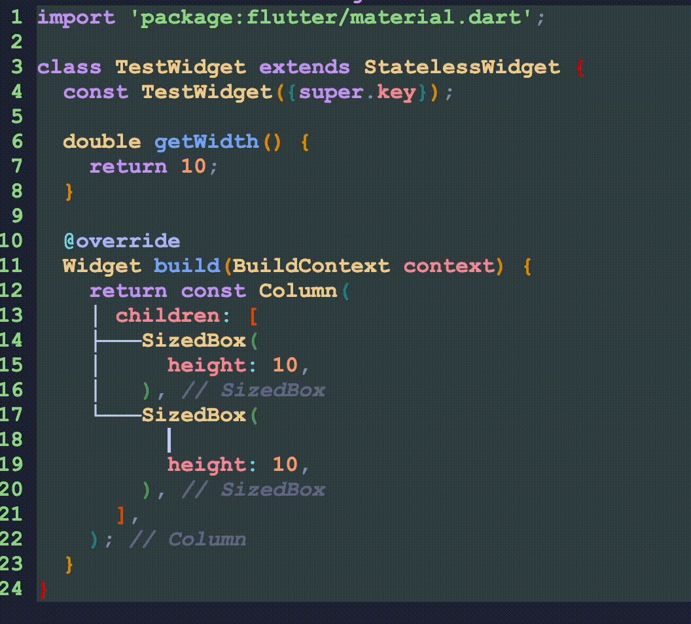

# Dart Const Organizer
Dart Const Organizer is a simple neovim plugin, helping organize `const` keywords in dart codes.

# ✨ Feature 
- **automatically add `const`**
- **automatically delete `const`**

# 📺 Showcase


# Installation
Install via your preferred package management.
### [Lazy](https://github.com/folke/lazy.nvim)
```lua
{
    "gcanoxl/dart-const-organizer.nvim",
    config = function()
        require('dart-const-organizer').setup()
    end
}

```

# Known Bugs
- [ ] when `const` and cursur are at the same line, cursor will move after the modification. 
